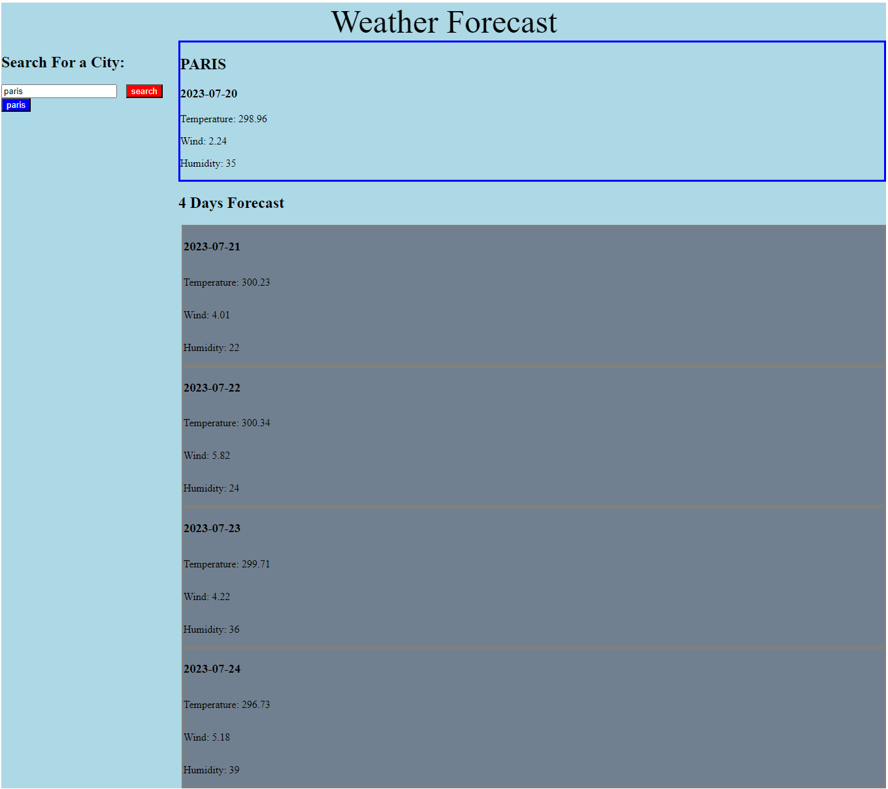

# RainbowWeather

For Module 6 I have been given a task to create a weather Application that would display current weather and 4 days of forecast.



```
API
I have used two API's in my application 
* GeoAPI
    To get the user input and to calculate the lat and lon
* 5 day weather forecast API
    After getting the lat and lon. It can be applied to this API to get the datas required for our application
```

# Technologies Used
### CSS
### HTML
### Javascript
### WeatherAPI

# Links
### Github Repo
https://github.com/moarshad100/RainbowWeather

### Github Application Link
https://moarshad100.github.io/RainbowWeather/
